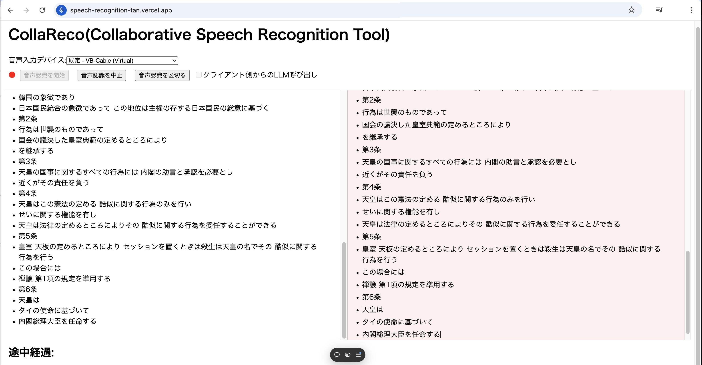

# CollaReco

CollaRecoは協調型音声認識ツールです。現在PoC段階です。
ツールの説明については[docs/index.md](docs/index.md)を参照ください。

## 画面



## 環境設定

### 必要なツール

- Node.js (推奨バージョン: 14.x 以上)
- npm (Node.jsに含まれています)

### GithubからのClone

```sh
git clone https://github.com/uehaj/speech-recognition.git
```

### 環境変数の設定

1. `.env.example` ファイルをコピーして `.env` ファイルを作成します。

```sh
cp .env.example .env
```

2. .env ファイルに必要な環境変数を設定します。

# OPENAI_*, AZURE_*

LLMとの連携には、以下の2つの方法が可能です。
 - (1) クライアント側がLLMへのAPIを発行
 - (2) サーバ側でLLMへのAPIを発行する

 (1)では、利用者がAPI KEYの準備をすることが必要です。(2)ではサーバ設定者がAPI KEYを準備します。

(1)の場合は、これらの環境設定は不要ですが、利用者が利用時にOPENAI_API_KEYに相当するキーの値をGUIから入力する必要があります。

(2)の場合は、.envの`OPENAI_*`もしくは`AZURE_*`ではじまる環境変数を設定してください。

# NEXT_PUBLIC_WEBSOCKET_URL

認識結果をリモートで同時編集するためのwebsocketサーバのWebSocket URLを設定します。

- "http://no_websocket"を設定する。この場合の同時編集は行なうことができません。
- "ws://localhost:1234" localhostにyjsの共有サーバを起動しておきそのURLを指定します。開発時には有用です。
- "wss://任意のホスト:1234"もしくは "wss://任意のホスト:1234" 任意のホストにyjsの共有サーバを起動しておきそのURLを指定する。ws:ではなくwss:つまりWebSocketのTLS設定が必要。音声入力デバイスアクセスを行わせる必要があるため、SSL証明書を設定したnginxやApachのリバースプロキシの設定も行う必要があるかもしれない。
- "wss://demos.yjs.dev/ws" yjsの開発元が提供する共有のホスト。こちらを使う際には他の利用者にも認識された情報が共有されるので注意。それを避けるには"wss://demos.yjs.dev/ws/+任意の文字列"などのように予測不能なURLにしておくのが良いかもしれないがサーバ側に情報が送信されることにはかわりはない。

とりあえず試すだけなら"wss://demos.yjs.dev/ws"を設定すると良いかもしれませんが、上記サーバには認識内容が送信されることに注意ください。

## 依存関係のインストール

```
npm install
```

## データベースの設定

Prismaを使用してデータベースを設定します。

```sh
 npm run db:push
```

### WebSocket サーバーの起動

必要に応じて、共同編集機能のために y-websocket サーバーを起動します。以下は.envでNEXT_PUBLIC_WEBSOCKET_URLに"ws://localhost:1234"を設定する場合です。

```
HOST=localhost PORT=1234 npx y-websocket
```

## 開発サーバーの起動

Next.js 開発サーバーを起動します。

```
npm run dev
```

## Chromeブラウザでの動作確認

Chromeブラウザで http://localhost:3000 にアクセスしてアプリケーションを確認します。マイクの設定を要求されたときには許可を行います。

## 音声認識の開始

「音声認識」ボタンを押下することで文字起こしが開始します。


### 主な使用技術

- T3 Stack(Create T3 App)
  - Next.js (Next15 App Router)
  - Prisma
    - Sqlite
  - tRPC
    - trpc-to-openapi
- TipTap
  - ProseMirror
    - Yjs
