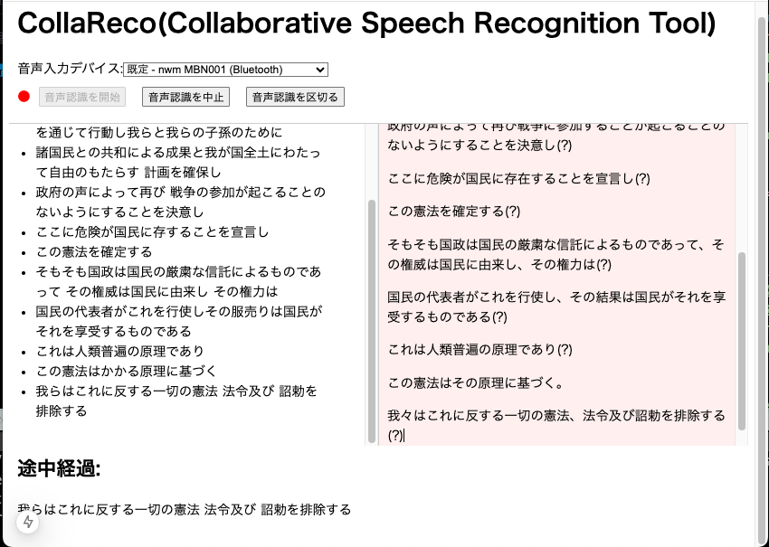

# CollaReco

CollaRecoは協調型音声認識ツールです。現在PoC段階です。
ツールの説明については[docs/index.md](docs/index.md)を参照ください。

## 画面



## 環境設定

### 必要なツール

- Node.js (推奨バージョン: 14.x 以上)
- npm (Node.jsに含まれています)

### 環境変数の設定

1. `.env.example` ファイルをコピーして `.env` ファイルを作成します。

```sh
cp [.env.example](http://_vscodecontentref_/1) .env
```

2. .env ファイルに必要な環境変数を設定します。

### データベースの設定

```sh
npx prisma migrate dev
```

Prismaを使用してデータベースを設定します。

起動手順
依存関係のインストール
プロジェクトの依存関係をインストールします。

```sh
npm install
```

### WebSocket サーバーの起動
共同編集機能のために y-websocket サーバーを起動します。

```
npx y-websocket
```

開発サーバーの起動

Next.js 開発サーバーを起動します。

```
npm run dev
```

ブラウザで http://localhost:3000 にアクセスしてアプリケーションを確認します。

### 主な使用技術

- T3 Stack(Create T3 App)
  - Next.js (Next15 App Router)
  - Prisma
    - Sqlite
  - Tailwind CSS
  - tRPC
    - trpc-to-openapi
- TipTap
  - ProseMirror
    - Yjs
